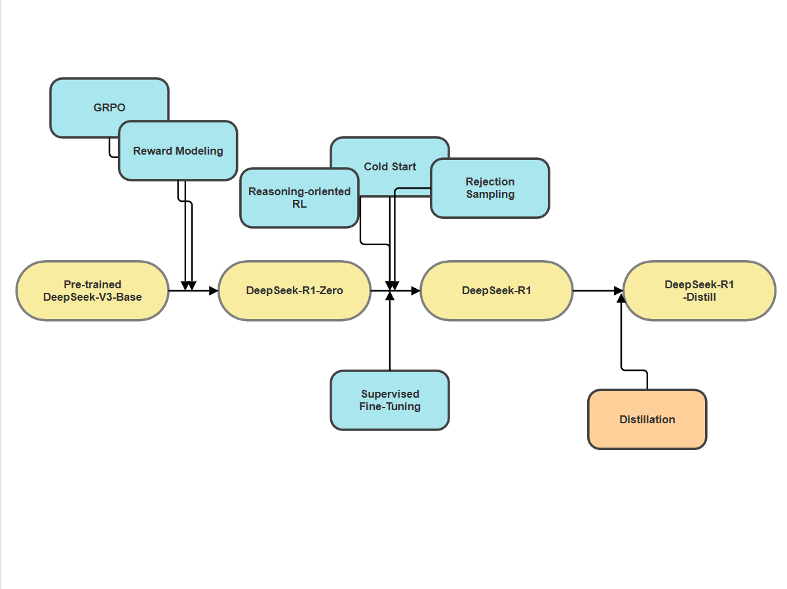
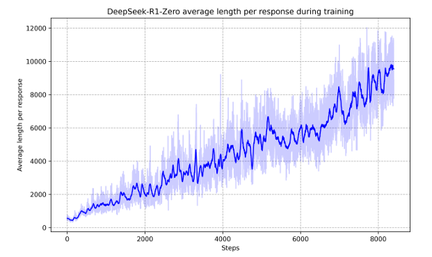
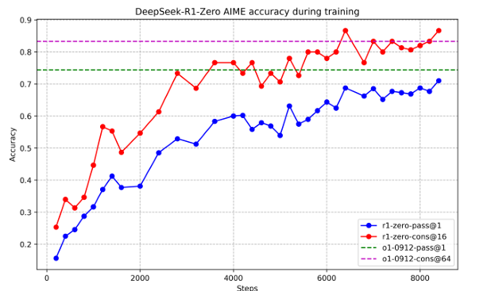

# DeepSeek-R1: Incentivizing Reasoning Capability in LLMs via Reinforcement Learning
---
**Paper**: DeepSeek-R1: Incentivizing Reasoning Capability in LLMs via Reinforcement Learning  
**Authors:** Daya Guo, Dejian Yang, Haowei Zhang, Junxiao Song (DeepSeek Research Team)    
**ArXiv:** [https://arxiv.org/abs/2305.13245  ](https://arxiv.org/abs/2501.12948)  
**Presented by:** Zhiqi(Camille) Zhang  
**Date:** Thursday, October 30, 2025  

## Overview
---
### Context
Imagine you are solving a tough math problem. At first, you try a direct approach, fail, then pause, reflect, and rethink your strategy. That little internal dialogue like “Wait, that doesn’t seem right… let’s try another way” is what we call **reasoning**.  

Modern language models are beginning to mimic this process. OpenAI recently introduced the idea of **inference-time scaling**, where a model can “think longer” by extending its **Chain-of-Thought (CoT)** during test time. The longer the reasoning chain, the more likely the model is to reach a correct, verifiable conclusion.  

This simple trick letting models reason for more steps has brought dramatic improvements across domains such as mathematics, programming, and scientific reasoning.  

However, it also raises a deeper question:  

> Can a model learn when and how to think without humans manually scripting its reasoning patterns?
---
### Problem Statement: The Challenge of Effective Test-Time Reasoning
Despite the progress of inference-time scaling, the research community still lacks an effective method to control and extend reasoning at test time. The difficulty lies in how to train models that can self-decide when to explore deeper reasoning paths.

Previous efforts have tried several directions:
- **Process-based Reward Models (PRM):** assign feedback for each reasoning step,  but they require fine-grained annotation and often fall into *reward hacking*.
- **Search Algorithms (e.g., MCTS or Beam Search):** imitate AlphaGo’s exploration strategy, yet token-level search spaces make them computationally infeasible at scale.
- **Hybrid Reinforcement Learning Approaches:** combine supervised labels and RL signals, but they depend heavily on expensive labeled data.

---
### How the problem was Addressed: From R1-Zero to R1 to R1-Distill
> Why Post-Training?  
> Improved reasoning accuracy, human-aligned behavior, efficiency

This paper answers that question by designing a **comprehensive post-training pipeline** centered on **pure Reinforcement Learning (RL)**, a process that allows a pre-trained language model to refine its reasoning ability without additional supervised data. At the heart of this work implemented through a custom algorithm called **Group Relative Policy Optimization (GRPO)**. A remarkable finding is that, even **without any supervised fine-tuning (SFT)**, the model can self-evolve into a reasoning agent purely through RL feedback. The base model (DeepSeek-V3-Base) starts with general linguistic capability but no explicit reasoning structure.  

| Stage | Model | Core Mechanism | Strengths | Limitations |
|:------|:-------|:---------------|:-----------|:-------------|
| **1** | **DeepSeek-R1-Zero** | Applies pure Reinforcement Learning on DeepSeek-V3-Base using GRPO | Emergent self-reflection, spontaneous long CoT reasoning, major benchmark gains | Low readability, language mixing |
| **2** | **DeepSeek-R1** | Adds cold-start SFT data + multi-stage RL pipeline | Improves coherence and stability, matches OpenAI o1-1217 performance | Higher training cost |
| **3** | **DeepSeek-R1-Distill** | Distills R1’s reasoning into smaller dense models (Qwen / Llama) | Efficient, low-cost reasoning comparable to larger models | Slight drop on hardest benchmarks |



#### Model Performance
- DeepSeek-R1-Zero, achieves **71%** on AIME 2024, rivaling OpenAI-o1-0912.  
- DeepSeek-R1, using a hybrid SFT+RL pipeline, reaches 79.8% on AIME and **95.6%** on MATH-500, surpassing o1-1217.  
- Distilled versions, such as R1-Distill-Qwen-14B, maintain similar reasoning ability while cutting inference cost dramatically.  
---

## Model Architecture

### DeepSeek-R1-Zero: Group Relative Policy Optimization (GRPO)
**Goal:**  
Teach a pre-trained model (DeepSeek-V3-Base) to reason logically without any supervised labels.

**Key Idea:**  
Instead of learning from human-annotated reasoning chains, the model learns through reward signals that tell it which answers are better.

**Components Used:**
- **GRPO (Group Relative Policy Optimization)** — a lightweight reinforcement learning algorithm.  
- **Reward Model** — evaluates whether each answer is accurate and well-formatted.  

#### GRPO

```text
Input: Pre-trained model πθ (DeepSeek-V3-Base)
Repeat for each batch of prompts Q:
    For each question q in Q:
        1. Generate G possible answers {o₁, o₂, ..., o_G}
        2. Compute reward for each answer:
            - Accuracy reward: Is the answer correct?
            - Format reward: Does it use <think>...</think> structure?
        3. Compute relative advantage Aᵢ = (rᵢ - mean(r)) / std(r)
        4. Update model parameters θ using:
               J(θ) = E[min(r(θ)*A, clip(r(θ), 1−ε, 1+ε)*A)] − β * KL(πθ || πref)
Output: Updated model πθ'
````
The model generates multiple answers, compares them to each other, learns which one is “better,” and updates itself accordingly.

#### Reward Model
In DeepSeek-R1-Zero, the reward model replaces human supervision by automatically scoring each generated answer. It uses two simple rule-based signals: an **accuracy reward**, which checks if the final answer is correct, and a **format reward**, which ensures the reasoning process follows the `<think>...</think>` structure. Unlike neural reward models that require human feedback and risk reward hacking, this rule-based setup is lightweight, objective, and scalable. Together with GRPO, it lets the model learn from its own outputs—gradually reinforcing clearer, more logical reasoning without any labeled data.

#### Emergent “Aha Moment”

During training, DeepSeek-R1-Zero began to display fascinating self-reflective reasoning behaviors.
At times, it paused, questioned its own logic, and revised previous steps just like a human realizing a mistake.

Example:

> “Wait, that seems wrong. Let’s check the equation again…”

This spontaneous self-correction, called the **“Aha Moment”**, was not programmed. It emerged naturally from reinforcement learning.



#### Outcome

- **Emergent Reasoning:** Model develops structured, multi-step logical reasoning.
- **Performance:** On AIME 2024, R1-Zero improved from **15.6% → 71%** pass@1 accuracy.
- **Limitation:** Outputs were sometimes verbose or mixed languages; reasoning lacked readability.


---
### Question 1:  
DeepSeek-R1-Zero is trained **without any supervised data**, no human-written reasoning examples or labeled answers. So how can it still learn to reason effectively and even exhibit self-correction behaviors like the “Aha Moment”?

<details>
<summary> Click to reveal the answer</summary>

DeepSeek-R1-Zero learns reasoning patterns entirely through reinforcement learning feedback. Each generated answer is automatically scored by a rule-based reward model, which checks correctness and logical format.  
Then, GRPO compares answers within each batch and reinforces the better ones. Over many iterations, this loop rewards structured, accurate reasoning allowing the model to self-discover logical thinking and reflection, even without explicit supervision. The “Aha Moment” emerges naturally from this process, as the model begins to pause, re-evaluate, and correct its own reasoning steps.
</details>

---

### DeepSeek-R1: Hybrid SFT + RL

**Goal:**
Make R1-Zero’s powerful reasoning more readable, aligned, and human-like.

#### Training Enhancements

1. **Cold Start (Supervised Fine-Tuning):**
   Use a few thousand manually curated long reasoning examples to initialize the model.

   * Helps stabilize early RL learning.
   * Introduces clear reasoning format and readable English.

2. **Reinforcement Learning with Cold Start:**
   Apply the same GRPO process, but now starting from a stable checkpoint.

   * Encourages deeper, more coherent reasoning chains.
   * Reduces nonsensical outputs.

3. **Rejection Sampling:**
   After RL, only the best response(by reward score) are kept for further fine-tuning.

   * Prevents overfitting to bad reasoning samples.
   * Sharpens logical accuracy.

#### Why It Works Better

By alternating between **SFT (human clarity)** and **RL (self-improvement)**, R1 finds a balance between human-like reasoning structure and machine-level consistency.It not only reasons well, but explains why it reached an answer in an interpretable `<think>` section.

#### Outcome

* **Performance:** AIME 2024: **79.8%**, MATH-500: **95.6%**, rivaling OpenAI o1-1217.
* **Behavior:** Structured, consistent, and interpretable reasoning steps.
* **Limitation:** Requires multiple fine-tuning stages; still resource-intensive.

---

### Question 2: 
DeepSeek-R1-Zero achieved impressive reasoning but still showed issues like unreadable outputs and mixed-language reasoning. What specific improvements in DeepSeek-R1 addressed these weaknesses, and how did they make the reasoning more stable and human-aligned?

<details>
<summary>Click to reveal the answer</summary>

DeepSeek-R1 fixed the main weaknesses of R1-Zero through a multi-stage hybrid training pipeline.  
1. It first added a cold-start supervised fine-tuning step using a few thousand curated reasoning examples.  
   This taught the model to follow clear, readable reasoning structures.  
2. It then re-applied reinforcement learning to enhance accuracy and logical depth while keeping that clarity.  
3. Finally, a rejection-sampling fine-tuning stage filtered only the highest-quality reasoning traces for further training.  
</details>

---

### DeepSeek-R1-Distill: Teaching Smaller Models to Reason

**Goal:**
Transfer the reasoning ability of large R1 models to smaller dense models like **Qwen** and **Llama**, making reasoning affordable and accessible.

#### Distillation Process

1. **Teacher:** DeepSeek-R1 (full model).
2. **Students:** Smaller dense models (Qwen-1.5B, Qwen-14B, Llama-8B, Llama-70B).
3. **Method:** Generate ~800k reasoning samples with `<think>` and `<summary>` sections.

   * These serve as *teaching material* for the smaller models.
4. **Training:** Student models learn to imitate both *the reasoning structure* and *final answers*.

#### Outcome

| Model                            | AIME 2024 | MATH-500 | GPQA Diamond | Codeforces |
| -------------------------------- | --------- | -------- | ------------ | ---------- |
| **GPT-4o**                       | 9.3       | 74.6     | 49.9         | 32.9       |
| **DeepSeek-R1-Distill-Qwen-14B** | **69.7**  | **94.3** | **59.1**     | **53.1**   |

This shows that distilled models, though smaller, **outperform many larger non-reasoning LLMs** like GPT-4o.

---

## Impacts

This work matters because it shows that **reasoning is not tied to human-labeled CoT data**. Before this paper, most strong reasoning models were still built on top of big, expensive SFT datasets. DeepSeek-R1-Zero breaks that assumption: it shows that if you design the right reward signals and the right RL objective (GRPO), a pre-trained LLM can grow its own reasoning habits through interaction, not instruction.

Concretely, the impact sits in four layers:

1. **Training paradigm shift**

   * From “collect more CoT → SFT → hope it generalizes”
   * To “incentivize reasoning at training time → model discovers longer, more reliable chains by itself”.
     This opens a path to *scalable* reasoning training, because rules are cheaper than human labels.

2. **Inference-time scaling gets a training-time partner**
   OpenAI showed that you can get better reasoning by letting the model “think longer” at inference. This paper shows the complementary piece: you can train a model so that it naturally chooses to think longer, reflect, and even backtrack. That closes the loop between *test-time reasoning* and *train-time incentives*.

3. **Democratization via distillation**
   They did not stop at a big model. By distilling R1 into Qwen/Llama small and medium models, they show that **reasoning can be transferred downward** and still beat “vanilla” dense models of similar size. That is important for open-source and for people who cannot run 70B+ models.

4. **Alignment + reasoning at once**
   Because rewards also include format and language consistency, the model becomes not only better at math/AIME but also **more readable** and **more controllable**. That is useful for downstream agents, tool-using systems, and educational settings.

If we place it in the AI timeline:

* **Past**: SFT + RLHF mainly for alignment / helpfulness.
* **Present**: test-time reasoning (o1) + structured CoT.
* **This paper**: RL for reasoning itself → “rewarded thinking”.
* **Future**: autonomous reasoning curricula, where models design harder tasks for themselves and use rule-based rewards to improve without humans in the loop.

---

## Critical Analysis

### What the Authors Accomplished Well

* **Showed that pure RL is enough to spark reasoning**: this is the central contribution. Starting from DeepSeek-V3-Base and only giving rule-based rewards, the model learned to lengthen its CoT, to reflect, and to fix mistakes. That is a strong empirical claim because many people believed you *must* seed with SFT first.
* **Made RL actually scalable for LLMs**: PPO-style methods usually need a critic; they replaced it with GRPO, which uses groupwise baselines. That is simpler to implement and cheaper to run, so it lowers the barrier for other labs to try reasoning-RL.
* **Separated “thinking” from “answer”** through the format reward. That small design decision is what makes their later analysis (e.g. aha moment) even possible, because you can literally see the model’s inner chain.
* **Closed the loop with distillation**: lots of works stop at “here is a fancy big model”. They went on to show that R1 can *teach* smaller dense models and that those distilled models outperform same-size models that were only SFTed. That makes the work practical.

### What Was Overlooked or Could Be Developed Further

* **Reward is still handcrafted.** The paper explicitly avoids neural reward models because of reward hacking, but the cost is that everything hinges on tasks that can be *rule-checked* (math, code, some logic). For open-ended reasoning (law, ethics, multi-agent), this reward scheme will not be enough.
* **Readability problems are mostly patched, not solved.** R1-Zero outputs mixed languages and messy CoT; R1 fixes it by adding cold-start SFT and a language-consistency reward. That means the pure-RL story is not fully clean: in practice, you still need *some* supervised signal to make the model human-usable.
* **Limited analysis of failure modes.** We see the good examples (emergent reflection), but we do not get a systematic breakdown of when RL makes the model *overthink*, produces unnecessarily long chains, or hallucinates justification to match the reward.
* **Search-based methods were dismissed quickly.** They mention MCTS and process reward models as “unsuccessful attempts,” but these could be revisited with better value models or hybrid test-time search. Right now the comparison feels a bit “we tried once, it was expensive.”
* **General capability still lags behind DeepSeek-V3.** The authors themselves note that R1 is optimized for Chinese/English reasoning and math-like tasks, but things like tool use, function calling, multi-turn dialogue, or JSON-structured outputs are weaker. That is important if someone wants to deploy this as a general assistant.
* **Benchmark choice favours reasoning-heavy tasks.** AIME, MATH-500, GPQA Diamond, Codeforces — these are perfect to showcase the method, but they do not tell us how the model behaves on messy, real-world, multi-hop retrieval tasks. A future paper should test whether “rewarded thinking” transfers to those settings.
* **No ablation on reward weights.** Since the behaviour is emergent, it would be useful to know how sensitive it is to the exact balance of accuracy vs format vs language rewards. Right now it is a bit “we found something that works,” but reproducibility across tasks is not fully demonstrated.

---
## Code Demo

```python
from transformers import AutoTokenizer, AutoModelForCausalLM
import torch

tokenizer = AutoTokenizer.from_pretrained("deepseek-ai/deepseek-r1-distill-qwen-7b")
model = AutoModelForCausalLM.from_pretrained(
    "deepseek-ai/deepseek-r1-distill-qwen-7b", 
    torch_dtype=torch.float16, device_map="auto"
)

prompt = "Solve step-by-step: If a number is doubled and increased by 3 gives 11, what is the number?"
inputs = tokenizer(prompt, return_tensors="pt").to(model.device)
outputs = model.generate(**inputs, max_new_tokens=200)
print(tokenizer.decode(outputs[0], skip_special_tokens=True))
```

## Resource Links
1. Original Parpaer:[DeepSeek-R1: Incentivizing Reasoning Capability in LLMs via Reinforcement Learning](https://arxiv.org/abs/2501.12948) - DeepSeek-AI, 2025
2. Open Source Code: [DeepSeek-R1](https://huggingface.co/deepseek-ai/DeepSeek-R1)
